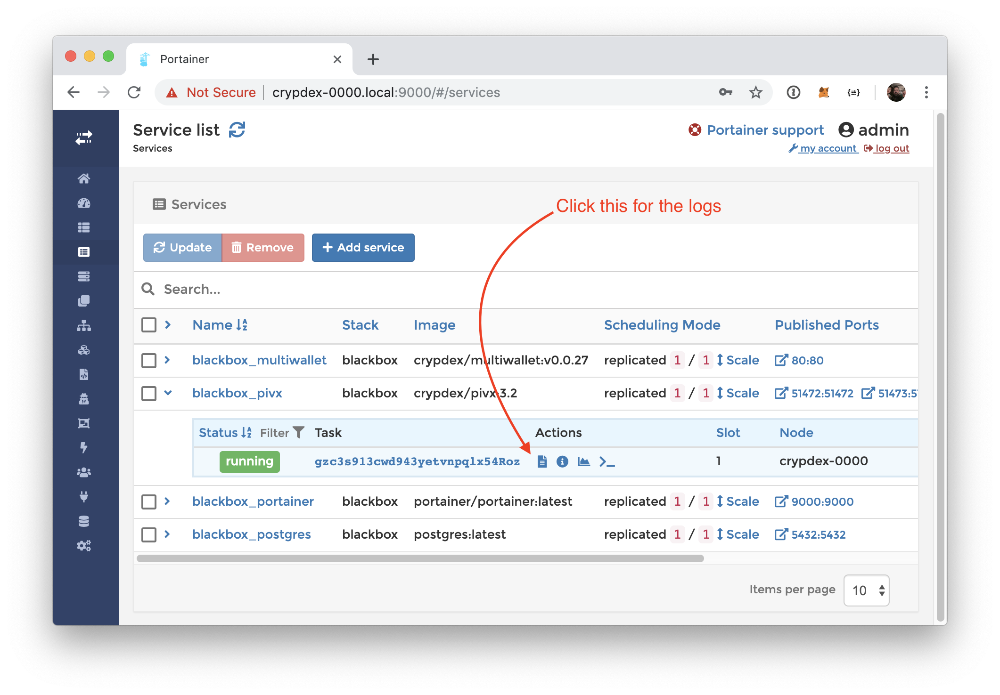
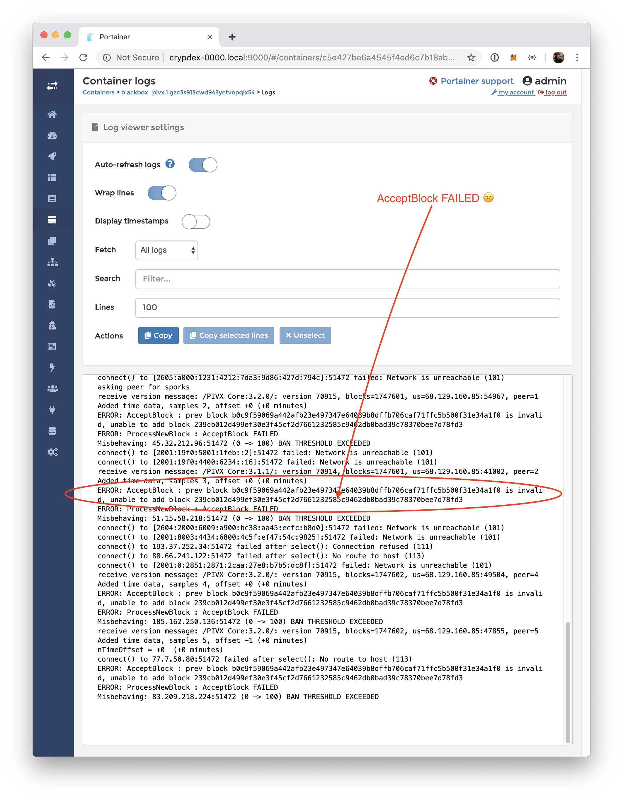
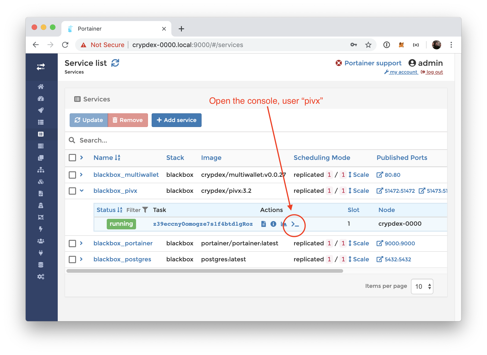

## No progress downloading the chain

Login to the box using the Portainer application

Navigate to the PIVX service and open the logs

The PIVX blockchain index takes about 15 minutes to load. If the last thing you see in the logs is `
init message: Loading block index...`, then its still loading.








Copy the block's has and issue the following command

```
pivx-cli reconsider block <>

```